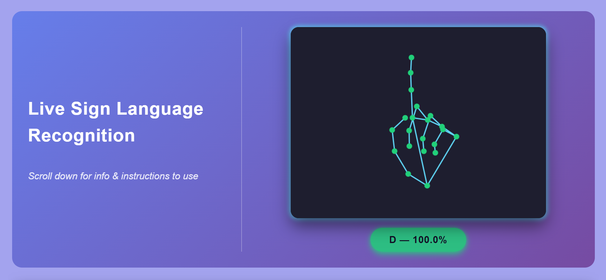
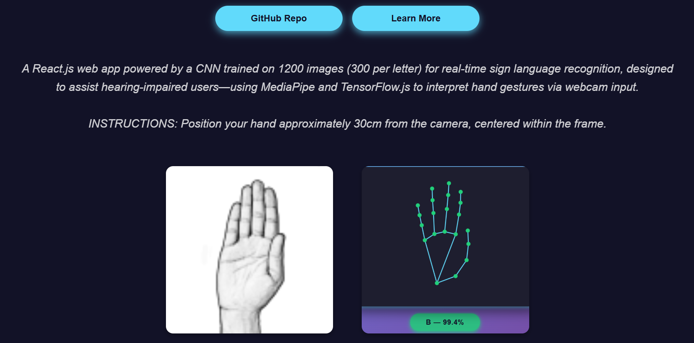
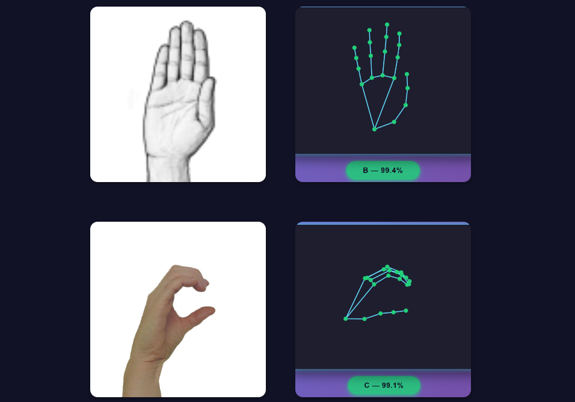
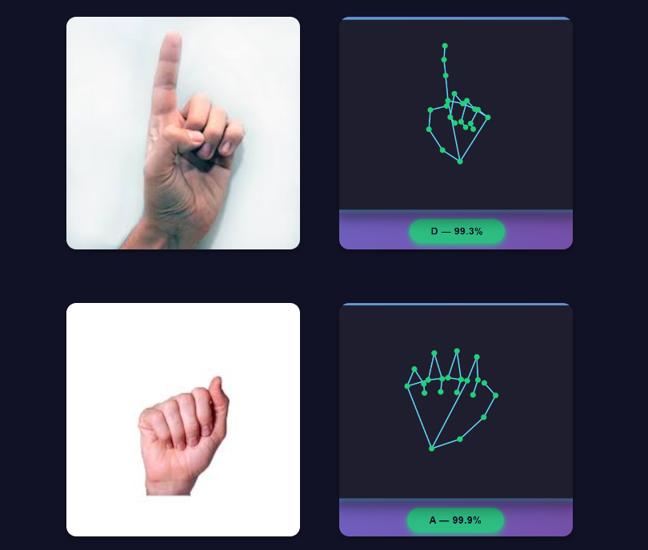

<!-- dataset : https://drive.google.com/drive/folders/1MClawaGwBxG4RykE4BVjYMjA_ZLG1iNR?usp=sharing -->
<!-- training : https://colab.research.google.com/drive/1lCNcS-VkEG96zweZX6lk-3goHAodyeSW?usp=sharing -->

# 🤟 Live Sign Language Recognition

A **React.js** web app that performs **real-time sign language detection** using a **custom CNN model trained with TensorFlow** and deployed with **TensorFlow.js**.  
The app uses **MediaPipe Hands** for hand landmark detection and a trained classifier to recognize gestures via your webcam.

---

## 🚀 Live Demo  
🔗 **[Click here to try out WebApp](https://sign-language-detection-bice.vercel.app/)**

---

## Dataset And Model Training

I personally captured and prepared the dataset for this project to ensure it was tailored for accurate gesture recognition.  
It contains **1,200 labeled images** across **4 gesture classes (A, B, C, D)**.

🔗 **[Dataset Link](https://drive.google.com/drive/folders/1MClawaGwBxG4RykE4BVjYMjA_ZLG1iNR?usp=sharing)**

🔗 **[Model Training](https://colab.research.google.com/drive/1lCNcS-VkEG96zweZX6lk-3goHAodyeSW?usp=sharing)**

---

## WebApp Preview

## 🎯 How It Works
- 1. Webcam feed is captured with **react-webcam**.
- 2. **MediaPipe Hands** detects hand landmarks in real-time.
- 3. The detected frame is converted to a **64×64 RGB tensor**.
- 4. A **TensorFlow.js CNN model**, trained on **1,200 images** across **4 gesture classes (A, B, C, D)**, predicts the gesture.
- 5. The UI displays the **predicted letter** and **confidence score**.

---

## 🛠 Tech Stack
- **Frontend:** React.js
- **ML Model:** TensorFlow / Keras , CNN 
- **Inference:** TensorFlow.js
- **Hand Detection:** MediaPipe Hands
- **Styling:** Inline CSS
